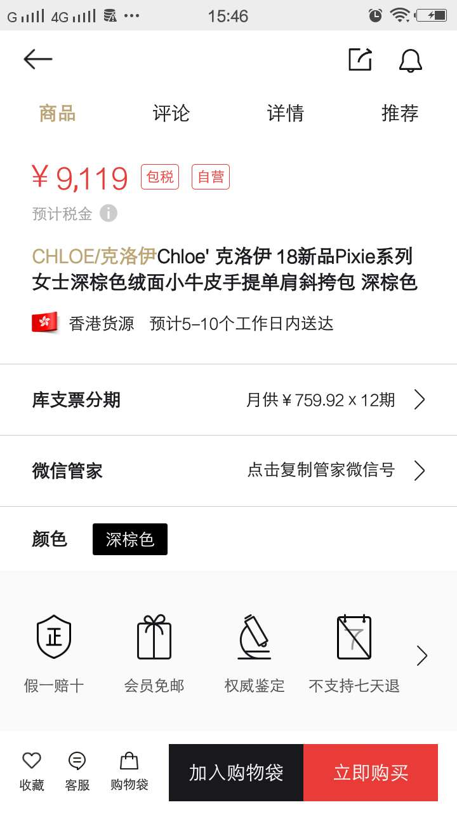
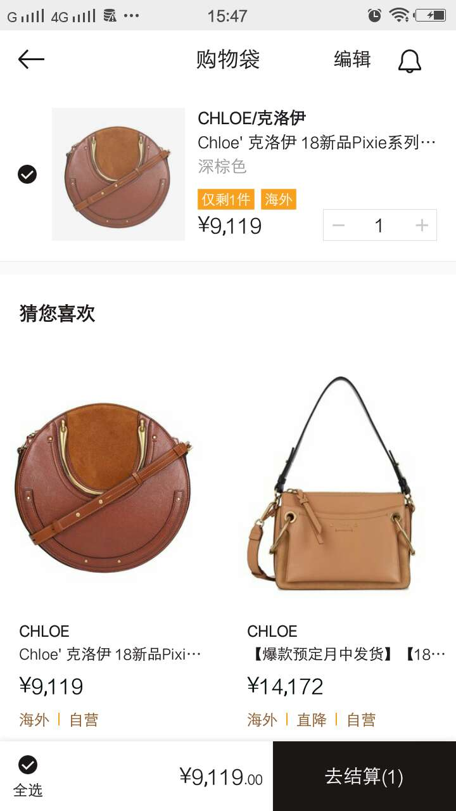

## 项目名称：
	寺库奢侈品

## 技术架构：
	 vue + vue-cli + vue-router + axios + vuex

## 项目启动：
	项目下载地址：git@gitlab.icketang.com:ickt_14/Graduation_design_4.git
	模块安装命令：npm install
	项目启动命令：yarn serve

## 项目结构：
	参考项目源码

## 项目成员及项目展示：
<table>
	<tr>
		<td>模块负责人</td>
		<td colspan="2" style="text-align: center;">张建华</td>
	</tr>
	<tr>
		<td>模块名称</td>
		<td>首页</td>
	</tr>
	<tr>
		<td>技术栈</td>
		<td>静态列表布局</td>
		<td colspan="2" style="text-align: center;">静态列表布局</td>
	</tr>
	<tr>
		<td>效果图</td>
		<td></td>
	</tr>
</table>

*****

<table>
	<tr>
		<td>模块负责人</td>
		<td colspan="2" style="text-align: center;">刘翔</td>
	</tr>
	<tr>
		<td>模块名称</td>
		<td>商品详情页</td>
	</tr>
	<tr>
		<td>技术栈</td>
		<td colspan="2" style="text-align: center;">静态列表布局</td>
	</tr>
	<tr>
		<td>效果图</td>
		<td></td>
	</tr>
</table>

*****

<table>
	<tr>
		<td>模块负责人</td>
		<td colspan="2" style="text-align: center;">朱仁慧</td>
	</tr>
	<tr>
		<td>模块名称</td>
		<td>购物袋</td>
	</tr>
	<tr>
		<td>技术栈</td>
		<td colspan="2" style="text-align: center;">静态列表布局</td>
	</tr>
	<tr>
		<td>效果图</td>
		<td></td>
	</tr>
</table>

